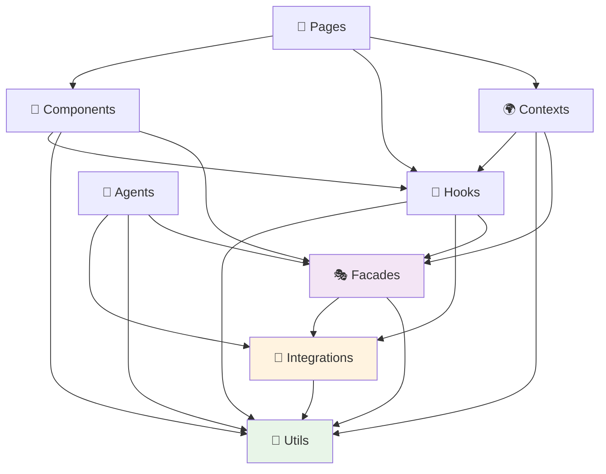

# 🚧 Arquitetura MadenAI - Boundaries & Dependências

## 📋 Resumo Executivo

Este documento define as **regras de dependência** entre módulos do MadenAI para garantir:
- ✅ **Arquitetura limpa** e manutenível
- ✅ **Prevenção de dependências circulares**
- ✅ **Separação clara de responsabilidades**
- ✅ **Facilidade de testes** e refatoração

## 🎯 Hierarquia de Dependências



## 📐 Regras de Dependência

### ✅ O QUE PODE IMPORTAR DE ONDE

#### 📄 **Pages** (Páginas)
```typescript
// ✅ PERMITIDO
import Component from '@/components/MyComponent'
import { useCustomHook } from '@/hooks/useCustomHook'
import { MyContext } from '@/contexts/MyContext'
import { AuthFacade } from '@/facades/auth'

// ❌ PROIBIDO
import { supabase } from '@/integrations/supabase' // Use facades
import { validateInput } from '@/utils/validation' // Use via hooks
```

**Justificativa**: Pages orquestram funcionalidades, mas não devem acessar diretamente integrações ou utils.

#### 🧩 **Components** (Componentes)
```typescript
// ✅ PERMITIDO
import { useAuth } from '@/hooks/useAuth'
import { formatCurrency } from '@/utils/formatting'
import { ProjectFacade } from '@/facades/project'

// ❌ PROIBIDO
import { supabase } from '@/integrations/supabase' // Use facades
import { MyContext } from '@/contexts/MyContext' // Use via props ou hooks
```

**Justificativa**: Components são reutilizáveis e não devem ter dependências de contexto ou integrações diretas.

#### 🎣 **Hooks** (Custom Hooks)
```typescript
// ✅ PERMITIDO
import { validateEmail } from '@/utils/validation'
import { supabase } from '@/integrations/supabase'
import { AuthFacade } from '@/facades/auth'

// ❌ PROIBIDO
import MyComponent from '@/components/MyComponent' // Circular dependency
import { MyContext } from '@/contexts/MyContext' // Use useContext interno
```

**Justificativa**: Hooks encapsulam lógica de negócio e podem acessar integrações, mas não UI.

#### 🌍 **Contexts** (Contextos)
```typescript
// ✅ PERMITIDO
import { useAuth } from '@/hooks/useAuth'
import { validateState } from '@/utils/validation'
import { AuthFacade } from '@/facades/auth'

// ❌ PROIBIDO
import MyComponent from '@/components/MyComponent' // Circular dependency
import { supabase } from '@/integrations/supabase' // Use facades
```

**Justificativa**: Contexts gerenciam estado global via hooks e facades, não diretamente com integrações.

#### 🤖 **Agents** (Agentes IA)
```typescript
// ✅ PERMITIDO
import { supabase } from '@/integrations/supabase'
import { processData } from '@/utils/dataProcessing'
import { AIFacade } from '@/facades/ai'

// ❌ PROIBIDO
import MyComponent from '@/components/MyComponent' // Agents são backend-like
import { useHook } from '@/hooks/useHook' // Agents não são React
```

**Justificativa**: Agents são lógica de backend, independentes da UI React.

#### 🎭 **Facades** (Facades)
```typescript
// ✅ PERMITIDO
import { supabase } from '@/integrations/supabase'
import { validateInput } from '@/utils/validation'
import { formatResponse } from '@/utils/formatting'

// ❌ PROIBIDO
import MyComponent from '@/components/MyComponent' // Facades são service layer
import { useHook } from '@/hooks/useHook' // Facades não são React
```

**Justificativa**: Facades encapsulam integrações e fornecem interface limpa para o frontend.

#### 🔗 **Integrations** (Integrações)
```typescript
// ✅ PERMITIDO
import { validateConfig } from '@/utils/validation'
import { formatError } from '@/utils/errorHandling'

// ❌ PROIBIDO
import MyComponent from '@/components/MyComponent' // Integrations são independentes
import { useHook } from '@/hooks/useHook' // Integrations não são React
import { AuthFacade } from '@/facades/auth' // Circular dependency
```

**Justificativa**: Integrações devem ser isoladas e independentes.

#### 🔧 **Utils** (Utilitários)
```typescript
// ✅ PERMITIDO
// Apenas imports de outras libs ou Node.js built-ins
import { format } from 'date-fns'
import crypto from 'crypto'

// ❌ PROIBIDO
import MyComponent from '@/components/MyComponent' // Utils são puras
import { useHook } from '@/hooks/useHook' // Utils são independentes
import { supabase } from '@/integrations/supabase' // Utils são puras
```

**Justificativa**: Utils são funções puras, sem dependências internas.

## 🚫 Dependências Proibidas

### ❌ **CIRCULAR DEPENDENCIES**
```typescript
// ❌ NUNCA FAÇA ISSO
// components/UserForm.tsx
import { useAuth } from '@/hooks/useAuth'

// hooks/useAuth.tsx  
import UserForm from '@/components/UserForm' // ❌ CIRCULAR!
```

### ❌ **SKIP DE CAMADAS**
```typescript
// ❌ Components acessando integrações diretamente
// components/ProjectCard.tsx
import { supabase } from '@/integrations/supabase' // ❌ Use facade!

// ✅ CORRETO - Use facade
import { ProjectFacade } from '@/facades/project'
```

### ❌ **UI EM CAMADAS DE DADOS**
```typescript
// ❌ Hooks importando components
// hooks/useProjects.tsx
import ProjectCard from '@/components/ProjectCard' // ❌ PROIBIDO!

// ❌ Integrations importando React
// integrations/supabase.ts
import { useState } from 'react' // ❌ PROIBIDO!
```

## 🎭 Papel das Facades

### 🛡️ **Facades como Interface**

As facades servem como **camada de abstração** entre frontend e integrações:

```typescript
// ✅ FACADE PATTERN
// facades/auth/AuthFacade.ts
export class AuthFacade {
  static async login(email: string, password: string) {
    const validated = validateCredentials(email, password) // utils
    return await supabase.auth.signIn(validated) // integration
  }
}

// hooks/useAuth.ts
import { AuthFacade } from '@/facades/auth'

export const useAuth = () => {
  const login = async (email: string, password: string) => {
    return await AuthFacade.login(email, password) // ✅ Via facade
  }
}
```

### 🔄 **Benefícios das Facades**

1. **Abstração**: Frontend não conhece detalhes de integração
2. **Substituibilidade**: Trocar Supabase por outra solução
3. **Testabilidade**: Mock das facades em testes
4. **Consistência**: Interface única para operações similares

## 📋 Checklist de Validação

### ✅ **Antes de Importar, Pergunte:**

1. **"Esta importação cria dependência circular?"**
   - Se sim: Refatore para quebrar o ciclo

2. **"Estou pulando camadas desnecessariamente?"**
   - Se sim: Use a facade apropriada

3. **"Esta dependência faz sentido arquiteturalmente?"**
   - UI não deve conhecer detalhes de backend
   - Utils devem ser independentes
   - Integrations devem ser isoladas

4. **"Posso testar este módulo isoladamente?"**
   - Se não: Dependências podem estar muito acopladas

## 🔧 Ferramentas de Validação

### 📊 **ESLint Import Guards**
```javascript
// quality/eslint-import-guards.cjs
module.exports = {
  rules: {
    '@/no-circular-deps': 'error',
    '@/enforce-boundaries': 'warn',
    '@/no-skip-layers': 'error'
  }
}
```

### 🔍 **Dependency Analysis**
```bash
# Verificar dependências circulares
npm run check-circular-deps

# Verificar boundaries
npm run check-boundaries
```

## 🎯 Padrões Recomendados

### ✅ **Data Flow Padrão**

```
User Action → Component → Hook → Facade → Integration → External API
     ↓           ↓        ↓       ↓          ↓
   Event    → State   → Logic → Abstract → Concrete
```

### 🔄 **Error Handling Flow**

```
Integration Error → Facade → Hook → Component → User Feedback
```

### 📊 **State Management Flow**

```
Context Provider → Hook → Component State → UI Update
```

## 🚨 Violações Comuns

### ❌ **Anti-Pattern 1: God Hook**
```typescript
// ❌ Hook fazendo tudo
const useEverything = () => {
  // ❌ UI logic
  const [showModal, setShowModal] = useState(false)
  
  // ❌ Direct integration access
  const { data } = supabase.from('projects').select()
  
  // ❌ Too many responsibilities
  return { data, showModal, setShowModal, login, logout, upload, ... }
}
```

### ❌ **Anti-Pattern 2: Smart Component**
```typescript
// ❌ Component com lógica de negócio
const ProjectCard = ({ id }) => {
  const [project, setProject] = useState(null)
  
  useEffect(() => {
    // ❌ Direct API call in component
    supabase.from('projects').select().eq('id', id)
      .then(setProject)
  }, [id])
  
  // ❌ Business logic in component
  const calculateBudget = () => { /* complex logic */ }
}
```

### ✅ **Correct Pattern: Separation of Concerns**
```typescript
// ✅ Hook com lógica
const useProject = (id) => {
  return useQuery(['project', id], () => 
    ProjectFacade.getById(id) // ✅ Via facade
  )
}

// ✅ Component focado em UI
const ProjectCard = ({ id }) => {
  const { data: project } = useProject(id) // ✅ Via hook
  
  return (
    <Card>
      <ProjectInfo project={project} />
      <ProjectBudget budget={project?.budget} />
    </Card>
  )
}
```

## 📚 Documentação Relacionada

- 🏗️ [Architecture Overview](./OVERVIEW.md) - Visão geral do sistema
- 🎭 [Facades Report](../refactor/FACADES_REPORT.md) - Status das facades
- 🔧 [Quality Guide](../../quality/QUALITY_GUIDE.md) - Padrões de qualidade
- 📊 [Refactor Plan](../refactor/MOVE_PLAN.md) - Plano de refatoração

---

**Última atualização**: 2025-08-25  
**Versão**: 1.0  
**Autor**: MadenAI Architecture Team

> 💡 **Lembre-se**: Boundaries existem para simplificar, não complicar. Quando em dúvida, escolha a opção que facilita testes e manutenção.