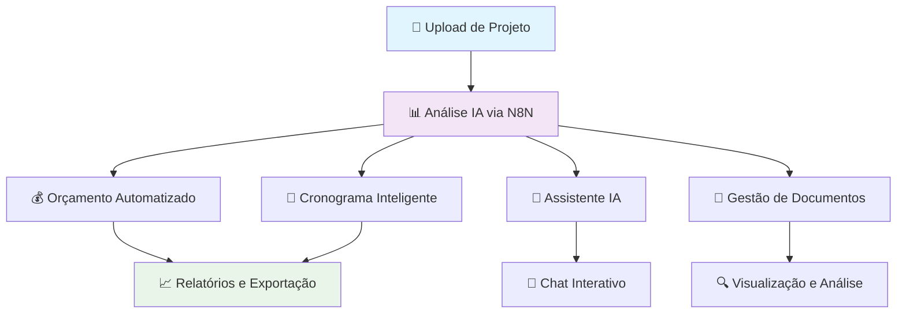
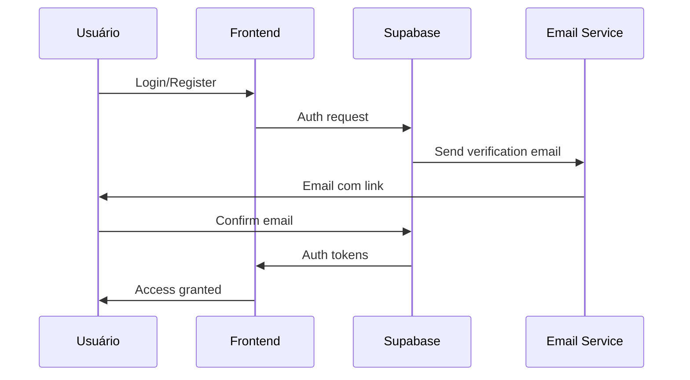
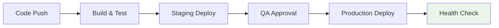

# 🏗️ Arquitetura MadenAI - Visão Geral

## 📋 Resumo Executivo

O **MadenAI** é um sistema de gestão e análise de obras que integra Inteligência Artificial para automatizar processos de orçamentação, cronogramas e análises técnicas. A plataforma oferece uma interface fluida e responsiva para desktop, tablet e mobile.

## 🎯 Fluxo Principal do Sistema



### 🔄 Fluxo Detalhado

1. **📤 Upload & Processamento**
   - Usuário carrega plantas, documentos ou dados do projeto
   - Sistema valida e processa arquivos
   - Dados são estruturados e armazenados

2. **🧠 Análise Inteligente**
   - N8N workflows analisam documentos via IA
   - Extração automática de quantitativos
   - Identificação de materiais e serviços

3. **📊 Geração de Resultados**
   - **Orçamento**: Custos automatizados com preços de mercado
   - **Cronograma**: Sequenciamento inteligente de atividades
   - **Assistente**: Interface conversacional para consultas
   - **Documentos**: Organização e análise de arquivos

4. **📈 Entrega & Análise**
   - Exportação em PDF e planilhas
   - Histórico de versões
   - Análises comparativas

## 🏛️ Camadas do Sistema

### 🎨 Frontend (React + Vite)
```
┌─────────────────────────────────────┐
│           INTERFACE REACT           │
├─────────────────────────────────────┤
│ • Pages (Dashboard, Projects, etc.) │
│ • Components (UI, Forms, Charts)    │
│ • Hooks (Custom business logic)     │
│ • Contexts (State management)       │
│ • Utils (Helpers, validation)       │
└─────────────────────────────────────┘
```

### ⚡ Backend (Supabase)
```
┌─────────────────────────────────────┐
│           SUPABASE CLOUD            │
├─────────────────────────────────────┤
│ • Database (PostgreSQL + RLS)      │
│ • Auth (2FA, email verification)   │
│ • Storage (Files, documents)       │
│ • Edge Functions (Business logic)  │
│ • Real-time (Live updates)         │
└─────────────────────────────────────┘
```

### 🤖 IA & Automação (N8N)
```
┌─────────────────────────────────────┐
│            N8N WORKFLOWS            │
├─────────────────────────────────────┤
│ • Document analysis               │
│ • Quantity extraction            │
│ • Cost calculation               │
│ • Schedule generation            │
│ • AI chat responses              │
└─────────────────────────────────────┘
```

### 🔌 Integrações Externas
```
┌─────────────────────────────────────┐
│           APIS EXTERNAS             │
├─────────────────────────────────────┤
│ • Geolocation services            │
│ • Email services                  │
│ • Market price APIs               │
│ • PDF/Document processors         │
└─────────────────────────────────────┘
```

## 📁 Estrutura de Diretórios

### 🎯 Diretórios Principais

```
src/
├── 📄 pages/              # Páginas principais da aplicação
│   ├── Dashboard.tsx      # Painel principal
│   ├── Projects.tsx       # Lista de projetos
│   ├── Budget.tsx         # Orçamento do projeto
│   ├── Schedule.tsx       # Cronograma
│   ├── Assistant.tsx      # Chat IA
│   └── Documents.tsx      # Gestão de documentos
│
├── 🧩 components/         # Componentes reutilizáveis
│   ├── ui/               # Componentes base (shadcn/ui)
│   ├── forms/            # Formulários específicos
│   ├── charts/           # Gráficos e visualizações
│   └── layout/           # Layout e navegação
│
├── 🎣 hooks/             # Custom hooks
│   ├── useAuth.ts        # Autenticação
│   ├── useProjects.ts    # Gestão de projetos
│   └── useAI.ts          # Integração com IA
│
├── 🌍 contexts/          # Context providers
│   ├── AuthContext.tsx   # Estado de autenticação
│   ├── ProjectContext.tsx # Estado do projeto atual
│   └── ThemeContext.tsx  # Tema claro/escuro
│
├── 🔧 utils/             # Utilitários e helpers
│   ├── validation.ts     # Validações de entrada
│   ├── formatting.ts     # Formatação de dados
│   └── export.ts         # Exportação de relatórios
│
├── 🔗 integrations/      # Integrações externas
│   ├── supabase/         # Cliente Supabase
│   └── n8n/             # Webhooks N8N
│
└── 🤖 agents/            # Agentes IA (futuro)
    └── assistants/       # Assistentes especializados
```

### 📋 Responsabilidades por Camada

#### 🎨 **Pages** (Páginas)
- Composição de telas completas
- Roteamento e navegação
- Integração de múltiplos componentes
- Estado específico da página

#### 🧩 **Components** (Componentes)
- Elementos reutilizáveis da UI
- Lógica de apresentação
- Interações do usuário
- Design system consistency

#### 🎣 **Hooks** (Hooks Customizados)
- Lógica de negócio reutilizável
- Integração com APIs
- Gerenciamento de estado local
- Side effects e sincronização

#### 🌍 **Contexts** (Contextos)
- Estado global da aplicação
- Compartilhamento entre componentes
- Provedores de funcionalidades
- Configurações transversais

#### 🔧 **Utils** (Utilitários)
- Funções puras e helpers
- Validações e transformações
- Formatação e conversões
- Lógica de apoio

#### 🔗 **Integrations** (Integrações)
- Clientes para APIs externas
- Configurações de conexão
- Mapeamento de dados
- Error handling específico

## 🔐 Segurança & Autenticação

### 🛡️ Camadas de Segurança

1. **Frontend Security**
   - Validação de entrada (XSS protection)
   - Rate limiting local
   - Sanitização de dados
   - Secure tokens handling

2. **Backend Security (Supabase)**
   - Row Level Security (RLS)
   - Políticas de acesso granulares
   - Autenticação 2FA obrigatória
   - Verificação de email

3. **Network Security**
   - HTTPS only
   - CORS configurado
   - Headers de segurança
   - API key protection

### 🔑 Fluxo de Autenticação



## 📊 Performance & Escalabilidade

### ⚡ Otimizações Frontend
- **Code splitting** por rotas
- **Lazy loading** de componentes
- **Image optimization** automática
- **Bundle size** monitorado

### 🚀 Otimizações Backend
- **Edge Functions** para baixa latência
- **Database indexing** otimizado
- **Cache strategies** implementadas
- **Real-time subscriptions** eficientes

### 📈 Métricas Monitoradas
- Load time por página
- API response time
- Error rates
- User engagement

## 🔄 Deploy & DevOps

### 🏭 Ambientes

1. **Development**
   - Local com hot reload
   - Supabase local instance
   - Debug mode ativo

2. **Staging**
   - Preview builds
   - Feature testing
   - QA validation

3. **Production**
   - Optimized builds
   - Performance monitoring
   - Error tracking

### 📦 Pipeline de Deploy



## 🎯 Roadmap Técnico

### 📅 Próximas Implementações

1. **Q1 2024**
   - Otimização de performance
   - Melhorias na IA
   - APIs adicionais

2. **Q2 2024**
   - Mobile app nativo
   - Integração ERP
   - Analytics avançados

3. **Q3 2024**
   - Machine learning models
   - Realidade aumentada
   - IoT integration

## 📚 Documentação Relacionada

- 📋 [Boundaries](./BOUNDARIES.md) - Limites arquiteturais
- 🔒 [Security](../security/) - Políticas de segurança
- 🗃️ [Database](../db/) - Estrutura do banco
- 🔧 [Quality](../../quality/) - Padrões de qualidade
- 📊 [Refactor](../refactor/) - Planos de refatoração

---

**Última atualização**: 2025-08-25  
**Versão**: 1.0  
**Autor**: MadenAI Architecture Team