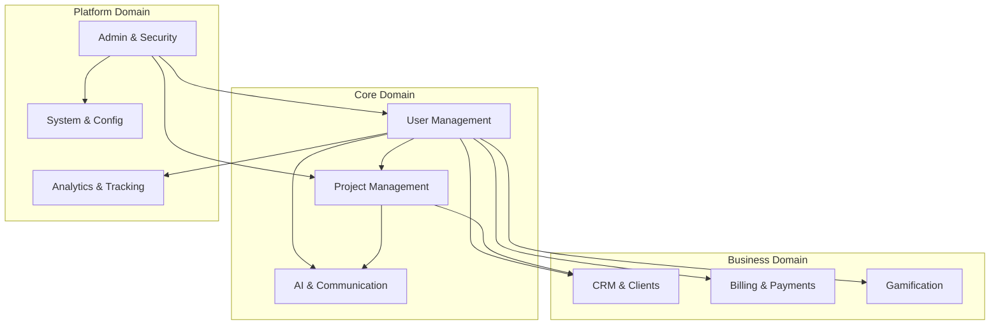
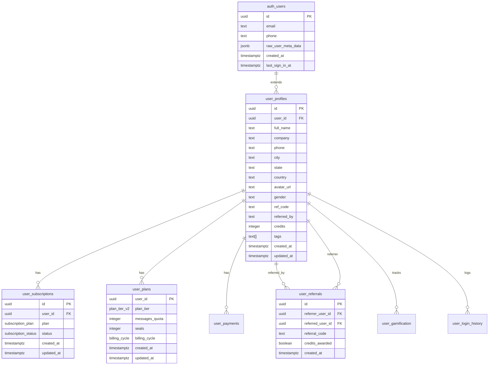
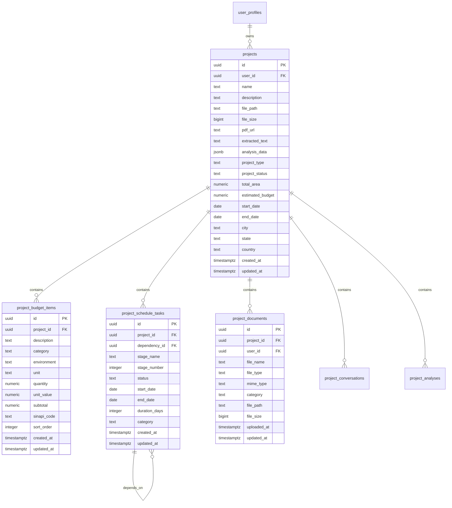
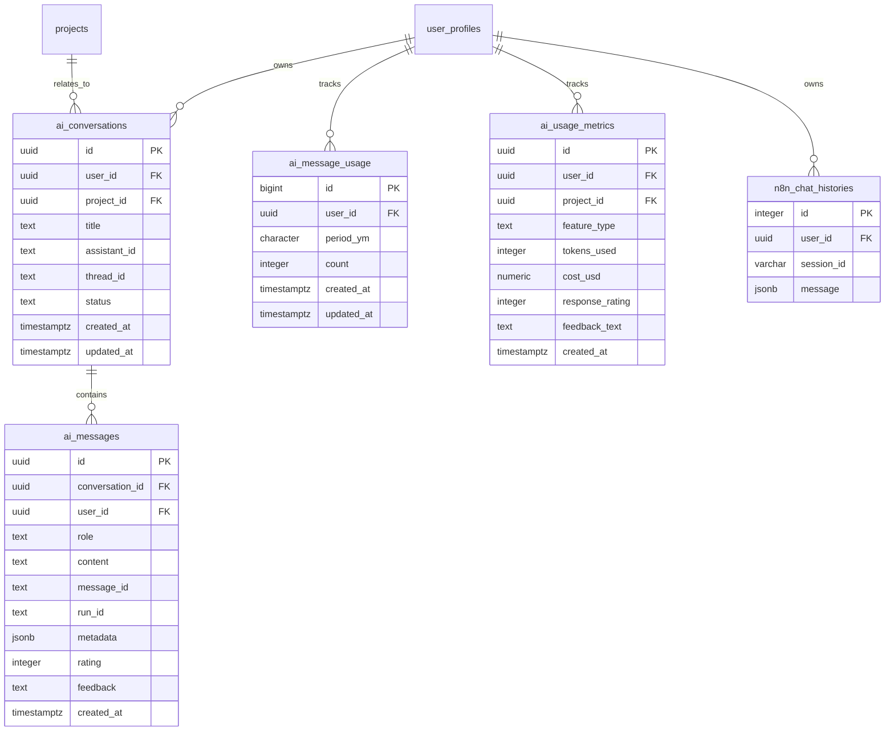
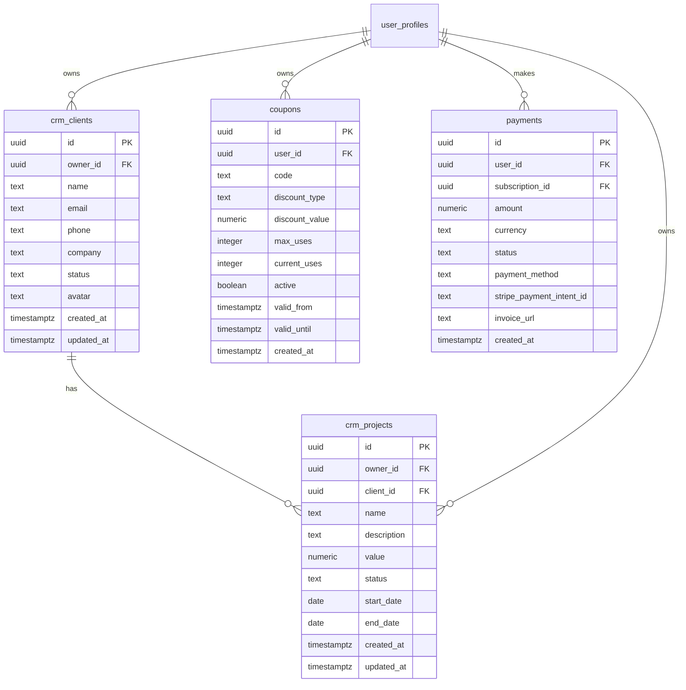
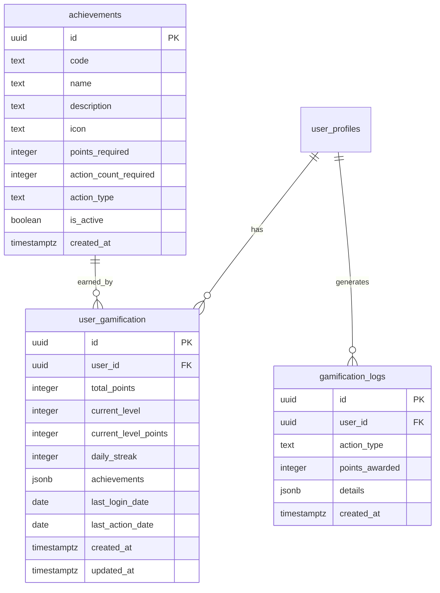
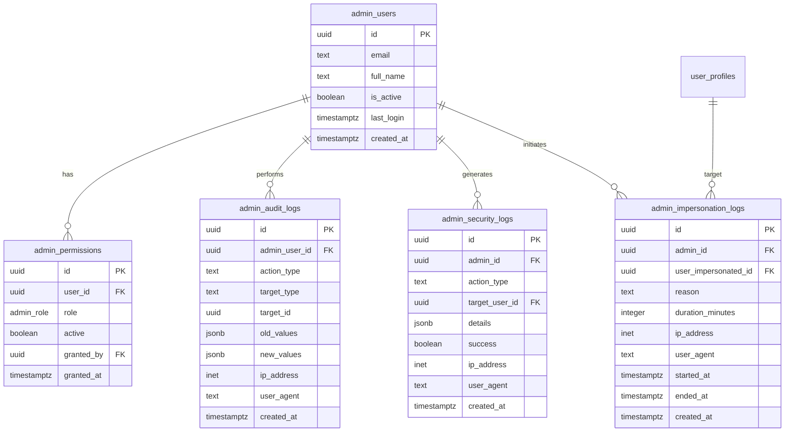
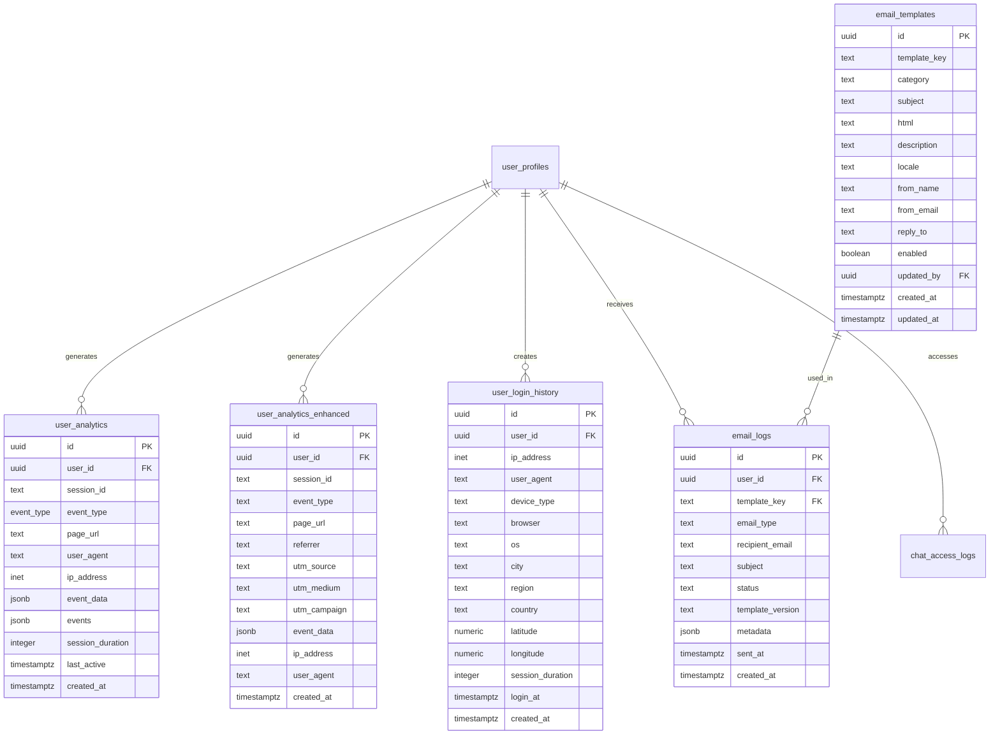
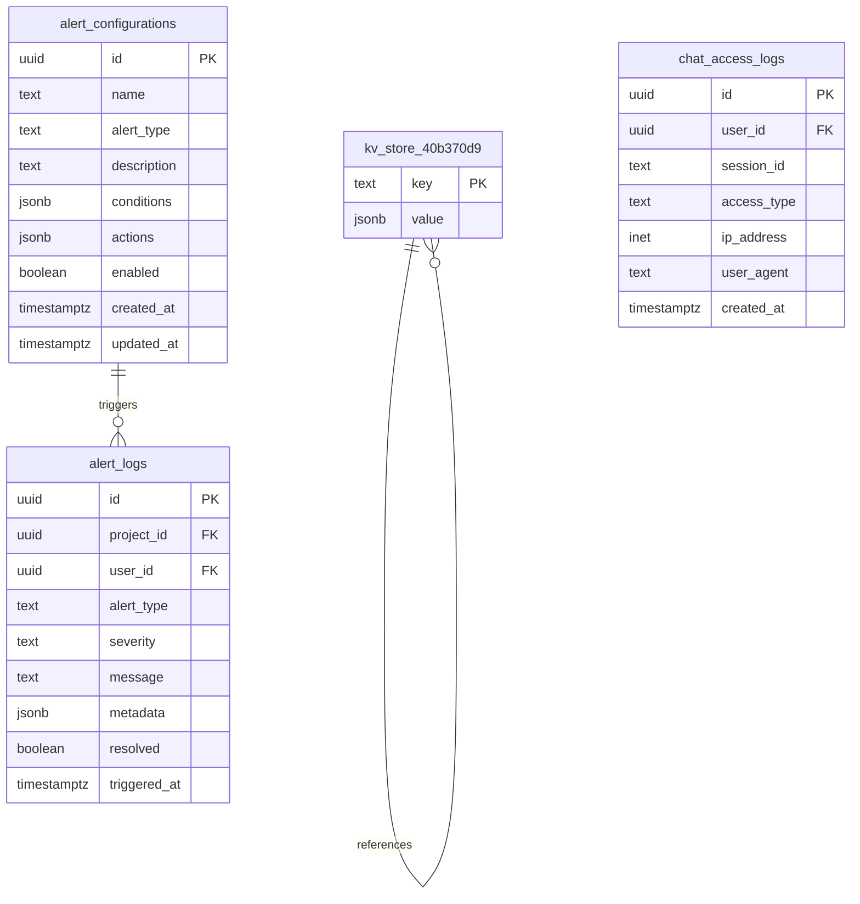

# 🔗 Entity Relationship Diagram - MadenAI

**Generated on:** 2025-08-25  
**Database:** PostgreSQL (Supabase)  
**Project ID:** mozqijzvtbuwuzgemzsm  

---

## ERD Overview

This document describes the entity relationships in the MadenAI database schema. Due to the complexity of the system (35+ tables), the ERD is organized into logical domains.

---

## Domain Architecture



---

## Core Domain ERD

### User Management Core



### Project Management Core



---

## AI & Communication Domain ERD



---

## CRM & Business Domain ERD



---

## Gamification Domain ERD



---

## Admin & Security Domain ERD



---

## Analytics & Tracking Domain ERD



---

## System & Configuration Domain ERD



---

## Cross-Domain Relationships

### Major Integration Points

1. **User → Everything**: All user-scoped data links to `user_profiles`
2. **Projects → AI**: Projects can have AI conversations and analyses
3. **Projects → CRM**: Projects sync to CRM system automatically
4. **Analytics → All**: User actions tracked across all domains
5. **Admin → Management**: Admin can audit and manage all user data

### Key Foreign Key Relationships

```sql
-- Core relationships
user_profiles.user_id → auth.users.id (logical, not enforced)
projects.user_id → user_profiles.user_id (enforced via RLS)

-- Project relationships
project_budget_items.project_id → projects.id
project_schedule_tasks.project_id → projects.id
project_documents.project_id → projects.id

-- AI relationships
ai_conversations.user_id → user_profiles.user_id
ai_conversations.project_id → projects.id
ai_messages.conversation_id → ai_conversations.id

-- CRM relationships
crm_clients.owner_id → user_profiles.user_id
crm_projects.owner_id → user_profiles.user_id
crm_projects.client_id → crm_clients.id

-- Admin relationships (enforced via RLS)
admin_audit_logs.admin_user_id → admin_users.id
admin_impersonation_logs.admin_id → admin_users.id
admin_impersonation_logs.user_impersonated_id → user_profiles.user_id
```

---

## Data Flow Patterns

### 1. User Signup Flow
```
auth.users (Supabase Auth)
    ↓ trigger: on_auth_user_created
user_profiles (via handle_new_user_profile())
    ↓ automatic
user_subscriptions (free plan)
    ↓ if referral
user_referrals (credit system)
    ↓ gamification
user_gamification (initial points)
```

### 2. Project Creation Flow
```
projects (user uploads)
    ↓ AI processing
project_analyses (AI results)
    ↓ budget generation
project_budget_items (SINAPI data)
    ↓ schedule generation
project_schedule_tasks (timeline)
    ↓ CRM sync
crm_projects (business tracking)
```

### 3. AI Interaction Flow
```
ai_conversations (session start)
    ↓ user messages
ai_messages (user input)
    ↓ N8N webhook
n8n_chat_histories (processing)
    ↓ AI response
ai_messages (assistant response)
    ↓ usage tracking
ai_message_usage (quota management)
    ↓ metrics
ai_usage_metrics (analytics)
```

---

## Cardinality Rules

### One-to-One (1:1)
- `user_profiles` : `user_plans` (each user has one plan)
- `user_profiles` : `user_gamification` (each user has one gamification record)

### One-to-Many (1:N)
- `user_profiles` : `projects` (user owns many projects)
- `projects` : `project_budget_items` (project has many budget items)
- `ai_conversations` : `ai_messages` (conversation has many messages)
- `crm_clients` : `crm_projects` (client has many projects)

### Many-to-Many (M:N)
- `user_profiles` : `achievements` (via `user_gamification.achievements` jsonb)
- `projects` : `ai_conversations` (projects can have multiple AI sessions)

---

## Indexing Strategy

### Primary Indexes (Automatic)
- All tables have UUID primary keys with B-tree indexes

### Foreign Key Indexes (Required)
```sql
-- User relationships
CREATE INDEX idx_projects_user_id ON projects(user_id);
CREATE INDEX idx_ai_conversations_user_id ON ai_conversations(user_id);
CREATE INDEX idx_crm_clients_owner_id ON crm_clients(owner_id);

-- Project relationships
CREATE INDEX idx_budget_items_project_id ON project_budget_items(project_id);
CREATE INDEX idx_schedule_tasks_project_id ON project_schedule_tasks(project_id);
CREATE INDEX idx_ai_conversations_project_id ON ai_conversations(project_id);

-- AI relationships
CREATE INDEX idx_ai_messages_conversation_id ON ai_messages(conversation_id);
```

### Composite Indexes (Performance)
```sql
-- Common query patterns
CREATE INDEX idx_projects_user_status ON projects(user_id, project_status);
CREATE INDEX idx_ai_messages_conversation_created ON ai_messages(conversation_id, created_at);
CREATE INDEX idx_budget_items_project_category ON project_budget_items(project_id, category);
```

---

## Data Integrity Rules

### Referential Integrity
- Enforced via PostgreSQL foreign keys where appropriate
- Supabase auth tables not directly referenced (RLS handles access)
- Cascade deletes for dependent data (budget items, messages, etc.)

### Business Rules
- Users can only access their own data (enforced via RLS)
- Projects must have valid user owners
- AI conversations must belong to valid users
- Admin actions must be performed by authorized admins

### Data Validation
- UUID generation for all primary keys
- Timestamp automation via triggers
- Enum constraints for status fields
- Check constraints for positive values (quantities, prices)

---

## Security (RLS) Patterns

### User Data Isolation
```sql
-- Pattern: Users see only their data
CREATE POLICY "users_own_data" ON table_name 
FOR ALL USING (auth.uid() = user_id);
```

### Project-Based Access
```sql
-- Pattern: Access through project ownership
CREATE POLICY "project_access" ON table_name 
FOR ALL USING (
  EXISTS (
    SELECT 1 FROM projects 
    WHERE projects.id = table_name.project_id 
    AND projects.user_id = auth.uid()
  )
);
```

### Admin Override
```sql
-- Pattern: Admins can access everything
CREATE POLICY "admin_access" ON table_name 
FOR ALL USING (is_admin_user());
```

---

## Performance Considerations

### Large Tables (>10K records)
- `ai_messages` - Partition by conversation_id
- `user_analytics_enhanced` - Partition by date
- `project_budget_items` - Index on project_id + category
- `user_login_history` - Archive old records

### Query Optimization
- Use covering indexes for common SELECT patterns
- Avoid N+1 queries with proper JOINs
- Implement pagination for large result sets
- Use JSONB indexes for metadata searches

### Scaling Strategies
- Read replicas for analytics queries
- Table partitioning for time-series data
- Archival strategies for audit logs
- Connection pooling for high concurrency

---

## Maintenance Tasks

### Daily
- Monitor index usage and performance
- Check for long-running queries
- Validate referential integrity

### Weekly
- Analyze table growth patterns
- Review slow query logs
- Update table statistics

### Monthly
- Archive old analytics data
- Rebuild fragmented indexes
- Review and optimize RLS policies

---

## Change Impact Analysis

When modifying this ERD:

1. **Adding Tables**: Ensure proper RLS policies and indexes
2. **Adding Relationships**: Update foreign key constraints and indexes
3. **Removing Tables**: Check for dependencies and cascade effects
4. **Modifying Columns**: Update application code and type definitions

---

**ERD Version:** 1.0  
**Last Updated:** 2025-08-25  
**Total Tables:** 35  
**Total Relationships:** 50+  
**Next Review:** 2025-09-25