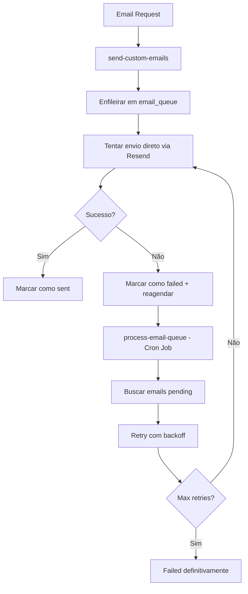

# 🔄 Sistema de Retry de E-mails - MadenAI

## Visão Geral

O sistema de retry garante que emails importantes não sejam perdidos em caso de falha temporária, implementando tentativas automáticas com backoff exponencial.

## 🏗️ Arquitetura do Sistema

### Componentes Principais



### Tabela: email_queue

| Campo | Tipo | Descrição |
|-------|------|-----------|
| `id` | uuid | ID único da fila |
| `user_id` | uuid | Usuário destinatário |
| `template_type` | text | Tipo do template (welcome_user, signup_confirmation, etc.) |
| `recipient_email` | text | Email de destino |
| `payload` | jsonb | Dados para processar o template |
| `status` | text | `pending`, `sent`, `failed`, `cancelled` |
| `retries` | integer | Número de tentativas (0-3) |
| `max_retries` | integer | Limite máximo (padrão: 3) |
| `last_attempt_at` | timestamp | Última tentativa |
| `next_retry_at` | timestamp | Próxima tentativa agendada |
| `error_message` | text | Última mensagem de erro |
| `resend_id` | text | ID do Resend quando enviado |

## ⚙️ Política de Retry

### Backoff Exponencial
- **1ª tentativa:** Imediato
- **2ª tentativa:** 1 minuto depois
- **3ª tentativa:** 5 minutos depois  
- **4ª tentativa:** 15 minutos depois
- **Após 3 falhas:** Marca como `failed` definitivamente

### Status de Email
- **`pending`:** Aguardando envio ou retry
- **`sent`:** Enviado com sucesso
- **`failed`:** Falhou definitivamente após 3 tentativas
- **`cancelled`:** Cancelado manualmente

## 🔧 Funcionamento Detalhado

### 1. Envio Inicial
```typescript
// Em send-custom-emails
1. Recebe request de email
2. Enfileira em email_queue com status 'pending'
3. Tenta envio direto via Resend
4. Se sucesso: marca como 'sent'
5. Se falha: marca como 'failed' + agenda retry
```

### 2. Sistema de Retry
```typescript
// Em process-email-queue  
1. Busca emails com status 'pending' e next_retry_at <= now()
2. Para cada email:
   - Busca template
   - Processa variáveis
   - Tenta envio via Resend
   - Atualiza status (sent ou failed + próximo retry)
```

### 3. Controle de Concorrência
- Usa `FOR UPDATE SKIP LOCKED` para evitar processamento duplicado
- Limite de 10 emails por batch para controlar carga
- Race condition protection na atualização de status

## 📊 Monitoramento e Métricas

### Consultas Úteis

#### Emails Pendentes
```sql
SELECT 
    template_type,
    COUNT(*) as pending_count,
    AVG(retries) as avg_retries
FROM email_queue 
WHERE status = 'pending'
GROUP BY template_type;
```

#### Taxa de Falha por Template
```sql
SELECT 
    template_type,
    COUNT(*) as total,
    COUNT(CASE WHEN status = 'failed' THEN 1 END) as failed,
    ROUND(COUNT(CASE WHEN status = 'failed' THEN 1 END) * 100.0 / COUNT(*), 2) as failure_rate
FROM email_queue 
WHERE created_at >= NOW() - INTERVAL '7 days'
GROUP BY template_type
ORDER BY failure_rate DESC;
```

#### Emails que Precisaram de Retry
```sql
SELECT 
    id,
    template_type,
    recipient_email,
    retries,
    error_message,
    created_at,
    last_attempt_at
FROM email_queue 
WHERE retries > 0 
  AND created_at >= NOW() - INTERVAL '24 hours'
ORDER BY retries DESC, created_at DESC;
```

#### Performance de Retry
```sql
SELECT 
    retries,
    COUNT(*) as count,
    COUNT(CASE WHEN status = 'sent' THEN 1 END) as eventually_sent,
    ROUND(COUNT(CASE WHEN status = 'sent' THEN 1 END) * 100.0 / COUNT(*), 2) as recovery_rate
FROM email_queue 
WHERE retries > 0
GROUP BY retries
ORDER BY retries;
```

## 🧪 Testando o Sistema

### Teste Manual de Retry
```bash
# 1. Enfileirar um email de teste
curl -X POST http://localhost:54321/rest/v1/rpc/enqueue_email \
  -H "Authorization: Bearer SERVICE_ROLE_KEY" \
  -H "Content-Type: application/json" \
  -d '{
    "p_user_id": "USER_UUID",
    "p_template_type": "welcome_user", 
    "p_recipient_email": "test@example.com",
    "p_payload": {"user_data": {"full_name": "Test User"}}
  }'

# 2. Processar fila manualmente
curl -X POST http://localhost:54321/functions/v1/process-email-queue \
  -H "Authorization: Bearer SERVICE_ROLE_KEY"
```

### Simular Falha para Teste
```sql
-- Marcar email como failed para testar retry
SELECT mark_email_failed(
  'QUEUE_ID_HERE'::uuid,
  'Teste de retry'
);
```

### Verificar Estado da Fila
```sql
SELECT 
    status,
    COUNT(*) as count,
    MIN(created_at) as oldest,
    MAX(created_at) as newest
FROM email_queue 
GROUP BY status;
```

## 🚀 Configuração e Deploy

### Cron Job Recomendado
```sql
-- Executar a cada 2 minutos
SELECT cron.schedule(
  'process-email-queue',
  '*/2 * * * *',
  $$
  SELECT net.http_post(
    url := 'https://mozqijzvtbuwuzgemzsm.supabase.co/functions/v1/process-email-queue',
    headers := '{"Content-Type": "application/json", "Authorization": "Bearer SERVICE_ROLE_KEY"}'::jsonb,
    body := '{}'::jsonb
  ) as request_id;
  $$
);
```

### Variáveis de Ambiente Necessárias
- `RESEND_API_KEY`: API key do Resend
- `SUPABASE_URL`: URL do projeto
- `SUPABASE_SERVICE_ROLE_KEY`: Service role key
- `SUPABASE_ANON_KEY`: Anon key

## 🛡️ Segurança e Boas Práticas

### Controles Implementados
- ✅ RLS policies na tabela email_queue
- ✅ Rate limiting via max_retries
- ✅ Timeout protection com FOR UPDATE SKIP LOCKED
- ✅ Error logging estruturado
- ✅ Backup via email_logs para auditoria

### Limitações e Considerações
- **Volume:** Processa até 10 emails por vez
- **Frequência:** Cron job a cada 2 minutos
- **Retenção:** Emails failed permanecem para análise
- **Dependência:** Resend como provedor único

## 🔍 Troubleshooting

### Problema: Emails não são processados
**Verificar:**
1. Cron job está ativo?
2. Edge function tem permissões?
3. Resend API key está válida?

**Solução:**
```sql
-- Verificar emails pendentes
SELECT * FROM email_queue WHERE status = 'pending';

-- Executar processamento manual
SELECT * FROM process_pending_emails_for_retry(10);
```

### Problema: Alta taxa de falha
**Verificar:**
1. Resend dashboard para quotas
2. Domínio verificado no Resend
3. Templates existem e estão válidos

**Solução:**
```sql
-- Analisar erros mais comuns
SELECT error_message, COUNT(*) 
FROM email_queue 
WHERE status = 'failed' 
GROUP BY error_message 
ORDER BY COUNT(*) DESC;
```

### Problema: Emails duplicados
**Verificar:**
1. Concorrência na edge function
2. Race conditions no processamento

**Solução:**
- Sistema já implementa SKIP LOCKED
- Verificar logs da edge function

## 📈 Métricas de Sucesso

### KPIs Principais
- **Taxa de Entrega Final:** > 98%
- **Tempo Médio para Entrega:** < 5 minutos
- **Recovery Rate (1ª tentativa falha):** > 90%
- **Emails Failed Definitivamente:** < 2%

### Alertas Recomendados
- Taxa de falha > 10% em 1 hora
- Mais de 50 emails pendentes
- Erro sistemático em template específico
- Cron job parado por > 10 minutos

---

*Documentação atualizada em: Janeiro 2025*  
*Versão do sistema: v1.0*